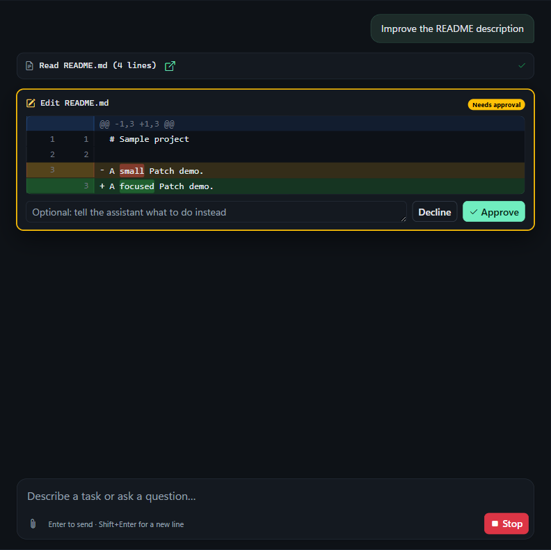

# CodeCompanion

A desktop AI coding assistant. Open a project folder, describe a task, and CodeCompanion reads the code, edits files, runs commands and checks its work, asking for your approval before it changes anything.

This is a from-scratch TypeScript rewrite of CodeCompanion.AI (6.x). See [CHANGELOG.md](CHANGELOG.md) for what changed.

Repository: https://github.com/PierrunoYT/CodeCompanion



## Features

- Chat with Claude (Opus 5.5 by default, Sonnet 5.5, Haiku 4.5), OpenAI GPT-6 (Astra, Sol, Luna) or any OpenAI-compatible endpoint, with streaming answers
- Works directly in your project: read, search, edit and create files, run commands
- Every file change and command is shown first (diffs, command text) and waits for **Approve** or **Decline** — or switch to **Auto** mode
- Decline with a note ("use pnpm instead") and the assistant adjusts
- Semantic code search over the project (needs an OpenAI key for embeddings); Settings shows whether the project is indexed (with progress while it builds) and can reindex it
- Built-in browser the assistant uses to check web apps: console output and screenshots
- Interactive terminal and a Git panel (diffs, commit, discard) next to the chat
- Web search (Google Custom Search) and page fetching
- Long chats are handled by server-side compaction (current Claude models)
- Chats are saved automatically and can be searched by title, project or message text, and exported as Markdown (download button in the header); per-project custom instructions
- `AGENTS.md` (or `CLAUDE.md`) in the project root is always added to the chat's instructions; the status bar shows "AGENTS.md loaded"
- Image attachments (attach or paste)

## Getting started

Requirements: Node.js 20.19+ or 22.12+, Git (optional, for the Git panel).

```bash
npm install
npm start
```

Then:

1. **File → Open Project…** and pick a folder.
2. Open **Settings** (gear icon, `Ctrl+,`) and add your Anthropic API key (and optionally an OpenAI key for code search, and a Google API key + search engine id for web search).
3. Describe a task, e.g. *"Add input validation to the signup form and a test for it."*

Recent projects are ordered by the latest open, including folders opened within the same millisecond.

To build an installer: `npm run dist` (Windows NSIS installer or macOS DMG in `dist/`).

For development in Amp orbs, the repository includes setup and resume scripts to prepare and reuse dependencies. See [orb setup](docs/DEVELOPMENT.md#amp-orbs) for requirements and headless test commands.

## Keyboard shortcuts

| Shortcut | Action |
|---|---|
| `Enter` / `Shift+Enter` | Send / new line |
| `Ctrl+O` | Open project |
| `Ctrl+N` | New chat |
| `Ctrl+.` | Stop the assistant |
| `Ctrl+,` | Settings |

(`Cmd` instead of `Ctrl` on macOS.)

## Privacy and security

- The app talks only to the APIs you configure (Anthropic, OpenAI or your OpenAI-compatible endpoint, Google search) and to pages you or the assistant open. There is no telemetry and no update check.
- API keys are encrypted with the operating system's keychain (Electron `safeStorage`) and never reach the UI process.
- The assistant's file access is confined to the open project folder. Commands run in your shell with your permissions — keep **Ask first** mode on unless you trust the task. In Settings, "Commands allowed without asking" lists commands (one per line, for example `npm test`) that skip the approval card in Ask first mode; a line also allows the command with arguments. Commands containing `;`, `&`, `|`, `>`, `<`, a backtick or `$(` are always asked about, and file edits always wait for you. Only allow commands you would run yourself: `npm run` would let the assistant run any script in `package.json`.
- The UI runs sandboxed without Node.js access; model output is sanitized before display.
- Web tools (page fetching, the built-in browser) run without asking and can reach any site, so a malicious web page the assistant reads could try to make it send project content elsewhere. Avoid pointing the assistant at untrusted pages in projects with secrets.

Details in [docs/ARCHITECTURE.md](docs/ARCHITECTURE.md#security-model).

## Documentation

- [Architecture](docs/ARCHITECTURE.md) — processes, IPC contract, agent loop, providers, tools, storage, security model
- [Development guide](docs/DEVELOPMENT.md) — setup, scripts, tests, where to change things
- [Contributing](CONTRIBUTING.md)
- [Tasks](TASKS.md) — roadmap with checkboxes
- [AGENTS.md](AGENTS.md) — guidance for AI coding agents working on this repo

## License

[MIT](LICENSE)
